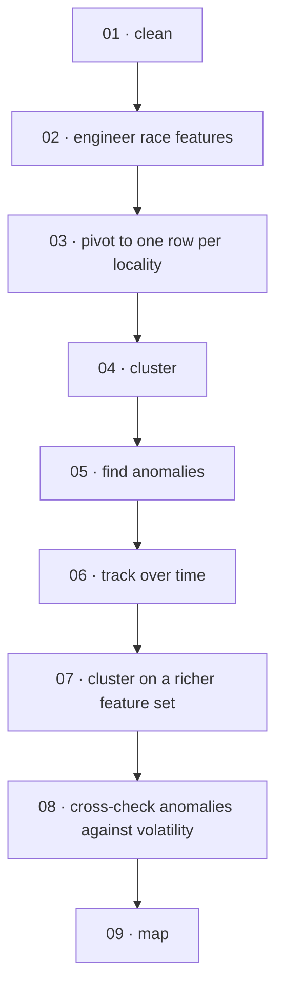
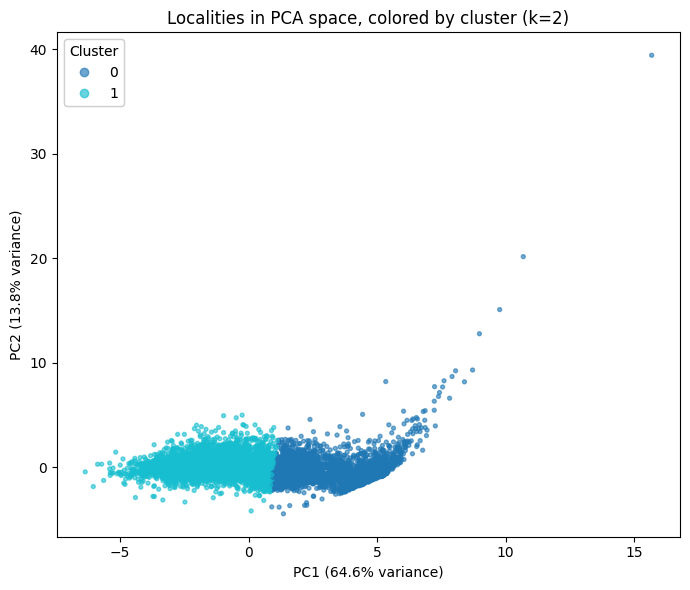
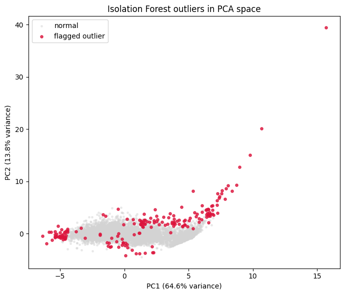
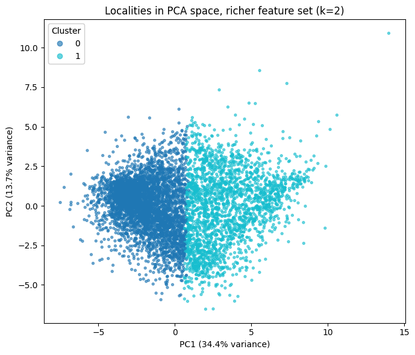
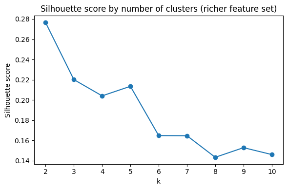
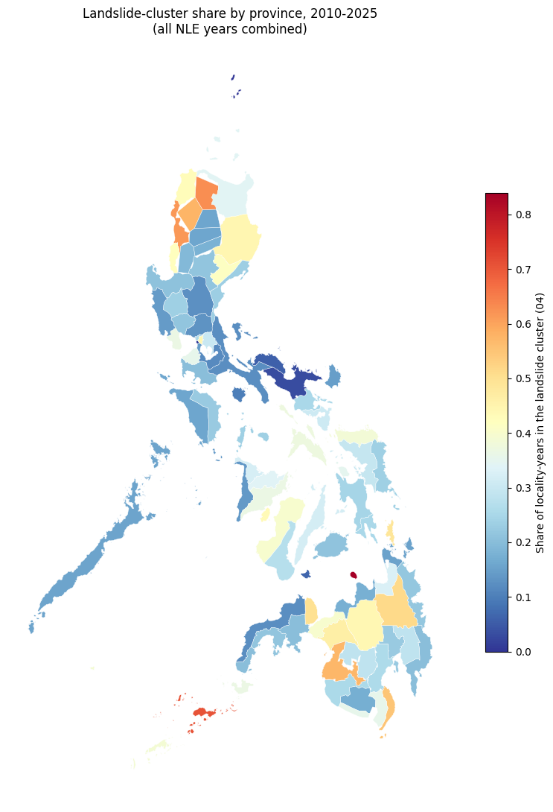

# Election Spatial Analysis 

An unsupervised analysis of Philippine National and Local Elections (NLE) results, 2010-2025,
looking at the *shape* of how each locality votes — how lopsided or contested its races are,
how fragmented its candidate fields get, whether that shape is stable or shifts over time —
rather than who wins. Nothing in this project uses winner labels, party affiliation, or any
outcome variable as a modeling target; every model here is unsupervised, built purely from
vote-share and concentration statistics computed from the raw tallies.

## Pipeline

Nine notebooks, each consuming the previous one's saved output and each stating explicitly what it deliberately leaves for the next:



Shared logic (text cleaning, locality grouping, feature builders, the geographic name-matching) lives in `src/common.py` and `src/geo.py` rather than being redefined per notebook, so every downstream notebook works from the same definitions.

## Notebooks

| Notebook | What it does |
|---|---|
| [`01_data_cleaning`](notebooks/01_data_cleaning.ipynb) | Loads the two raw OpenHalalan extracts (2.1M vote rows), fixes double-HTML-escaped text, audits real per-year/per-position coverage and drops the broken combinations, splits party list from candidate races, cross-validates implied winners against the separate Winners file (92.2% match). |
| [`02_feature_engineering`](notebooks/02_feature_engineering.ipynb) | Builds one row per `(year, position, locality)`: vote share, margin, HHI concentration, effective number of candidates (ENC). |
| [`03_locality_features`](notebooks/03_locality_features.ipynb) | Pivots the long race table into one wide row per `(year, province, city)` - the actual clustering-ready matrix. Vote-weights multi-district House races into a single per-city figure. |
| [`04_clustering`](notebooks/04_clustering.ipynb) | KMeans + PCA on Mayor/Vice Mayor/Councilor features, all 6 years. Silhouette score picks k=2: a landslide cluster (28.8%) and a competitive cluster (71.2%). |
| [`05_anomaly_detection`](notebooks/05_anomaly_detection.ipynb) | Isolation Forest on the same features - which locality-years look nothing like the rest, independent of which cluster they'd fall into. Flags 180 rows (2%), concentrated in Maguindanao, Sulu, and Lanao del Sur. |
| [`06_temporal_analysis`](notebooks/06_temporal_analysis.ipynb) | Follows each locality's cluster label across its election history. 71.7% of consecutive elections keep the same cluster; the competitive cluster is stickier (78.1%) than the landslide one (54.1%). |
| [`07_richer_clustering`](notebooks/07_richer_clustering.ipynb) | Re-clusters 2016+ only, adding Governor/House/Senator/Party List (27 features vs. `04`'s 9). Checked against `04` directly: a real refinement, not a re-derivation - one of `04`'s clusters splits ~80/20 across the richer clusters. |
| [`08_anomaly_temporal`](notebooks/08_anomaly_temporal.ipynb) | Does an anomalous election (`05`) predict a locality that's volatile over time (`06`)? Tested with Mann-Whitney U and chi-square - a genuine null result (p = 0.056, p = 0.88), reported as such rather than forced. |
| [`09_geographic_map`](notebooks/09_geographic_map.ipynb) | First actual map. Joins `04`'s cluster labels to PSGC province boundaries, resolving real name mismatches (Maguindanao's 2022 split, NCR district naming), exports a choropleth and a GeoJSON. |

## Data

**Vote counts & winners** - OpenHalalan NLE extracts, 2007–2025 (2010–2025 retained after the coverage audit). Not redistributed here.
**Province boundaries** - PSGC-coded shapefiles via [altcoder/philippines-psgc-shapefiles](https://github.com/altcoder/philippines-psgc-shapefiles), converted to GeoJSON by [faeldon/philippines-json-maps](https://github.com/faeldon/philippines-json-maps) (MIT). Small and redistributable, shipped in `data/raw/`.

## Feature Definition

```python
top1_share, top2_share = shares of the top two finishers
margin = top1_share - top2_share          # 1.0 for an uncontested race
hhi    = sum(share_i ** 2 for each candidate)   # concentration, 1.0 = one candidate takes all
enc    = 1 / hhi                          # effective number of candidates
```

Clustering and anomaly detection both drop `hhi` (redundant with `enc`) and log-transform `enc` (raw skew 2.33 → -0.02), built once by `build_core_feature_matrix` in `src/common.py` so `04`–`08` never redefine "core features" slightly differently.

## Clustering



Two clusters separate cleanly on Mayor/Vice Mayor/Councilor margin and concentration - one landslide-leaning, one competitive - confirmed against the actual most-lopsided and most-competitive Mayor races in the data, not just against each other.

## Anomaly Detection



Outliers aren't confined to one cluster's territory - "unusual" here is measured against the whole dataset, not against whichever cluster a point nominally belongs to. The two dominant shapes: a near-tied Mayor race paired with a wildly fragmented Councilor race, and a Mayor+Vice Mayor pair both completely uncontested in the same election.

## Richer Clustering (2016+)




Adding province/district/national columns (Governor through Party List) for the four years that support it 97.6% complete-case - refines rather than repeats `04`'s split: one simple cluster fans out roughly 80/20 across the two richer clusters.

## Geographic Map



Province-level choropleth of landslide-cluster share, all years combined. BARMM provinces (Sulu, Maguindanao) and Ilocos Norte/Sur sit at the landslide-heavy end, consistent with `04`'s independent by-region breakdown (BARMM at 51.7%).

## Key Findings So Far

- **Vote shape is a real, learnable signal.** A silhouette score of 0.534 on the simple 9-feature model (well above the 0.15 noise floor) says the landslide/competitive split isn't an artifact of scale.
- **Competitiveness is "stickier" than landslides.** A locality in the competitive cluster stays there 78.1% of the time between elections; a landslide locality only 54.1%.
- **One-off anomalies and long-run volatility are separate questions.** Being flagged unusual in a single election does not predict how often a locality's cluster label flips over time - checked directly with two independent tests, both null.
- **More ballot data refines the picture without just restating it.** The 27-feature 2016+ model isn't a redundant re-derivation of the 9-feature model, but it trades six years of coverage for four.
- **Geography confirms the by-region numbers independently.** The province map wasn't required to agree with `04`'s region breakdown - it does, which is evidence the clustering is picking up something real rather than noise.

## Deliberately Out of Scope (so far)

City-level (not just province-level) geographic joins; mapping the `05`/`08` anomaly and volatility findings geographically; proper party-list seat-allocation modeling (still handled with the same descriptive share/concentration treatment as everything else); any claim about fraud or wrongdoing - this is a vote-shape comparison, not a fraud-detection model.