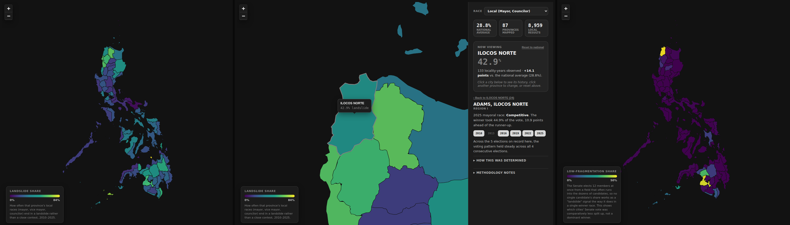

# Hugis ng Boto

> An unsupervised, six-race analysis of how lopsided or contested Philippine elections have
> been, 2010-2025. Every notebook below is a real, executed run, not a narrative written after
> the fact.



## Why

Election coverage almost always asks who won. This project asks a different question: how
*lopsided* was the result, and does that pattern hold steady or shift over time? Nothing here
uses a winner label, a party affiliation, or any outcome variable as a modeling target, every
model is unsupervised, fit purely from vote-share and concentration statistics computed from the
raw tallies. Two OpenHalalan extracts (a ~2.09M-row per-candidate vote count file and a ~157k-row
declared-winners file, 2001-2025) feed eleven notebooks and one interactive map, **Vote-Shape
Map**, built on top of their outputs. Full data provenance and every known data-quality issue live
in `data/README.md`.

## Pipeline

`01`-`03` clean the raw tallies into one row per locality per election. `04` fits the first
model. `05`-`08` branch off it for anomaly detection and temporal stability. `09` joins the result
to real province boundaries. `10` rolls everything into a summary. `11` reruns `04`'s method
against five more race types. One function builds every feature matrix in the project, whichever
race is being clustered:

```python
def build_group_feature_matrix(locality_features, positions, metrics=CORE_METRICS):
    feature_cols = [f"{p}_{m}" for p in positions for m in metrics]
    complete = locality_features[feature_cols].notna().all(axis=1)
    df = locality_features[complete].reset_index(drop=True).copy()

    X = df[feature_cols].copy()
    for p in positions:
        X[f"{p}_enc"] = np.log(X[f"{p}_enc"])  # right-skewed: 2.33 raw -> 0.02 after log

    return df, X, feature_cols
```

`04` calls it with three positions (Mayor, Vice Mayor, Councilor). `11` calls the same function,
unmodified, with five other position groups. No feature logic is duplicated across notebooks.

## Clustering

Every race in this project is clustered the same way: standardize, reduce with PCA to 90%+
variance, sweep k=2..10 scored by silhouette, fit the winner, then relabel so cluster `0` always
means "more lopsided" (KMeans itself assigns cluster numbers arbitrarily):

```python
X_scaled = StandardScaler().fit_transform(X)
X_pca = PCA(n_components=n_components, random_state=42).fit_transform(X_scaled)  # 90%+ variance

best_k = max(range(2, 11), key=lambda k: silhouette_score(
    X_pca, KMeans(n_clusters=k, random_state=42, n_init=10).fit_predict(X_pca)))

kmeans = KMeans(n_clusters=best_k, random_state=42, n_init=10)
df["cluster"] = kmeans.fit_predict(X_pca)

dominant = df.groupby("cluster")[f"{headline}_top1_share"].mean().idxmax()
```

## Notebooks

| Notebook | What it is |
|---|---|
| [`01_data_cleaning`](notebooks/01_data_cleaning.ipynb) | Loads both raw files (2,088,099 vote rows, 157,333 winner rows), fixes double HTML-entity escaping, audits per-year reporting coverage, cross-validates against the winners file (92.2% match rate). |
| [`02_feature_engineering`](notebooks/02_feature_engineering.ipynb) | Computes top1 share, margin, and Herfindahl-Hirschman concentration per race. 7.1% of local races (5,338 of 75,055) turn out uncontested. |
| [`03_locality_features`](notebooks/03_locality_features.ipynb) | Reshapes into one row per (year, province, city): 9,570 locality-years across 81 columns. |
| [`04_clustering`](notebooks/04_clustering.ipynb) | **First model.** Mayor/Vice Mayor/Councilor, k=2, silhouette 0.534: 28.8% "landslide," 71.2% "competitive." |
| [`05_anomaly_detection`](notebooks/05_anomaly_detection.ipynb) | Isolation Forest flags 180 of 8,967 rows (2.0%) as statistically unusual, independent of cluster. |
| [`06_temporal_analysis`](notebooks/06_temporal_analysis.ipynb) | Tracks each locality's cluster label across its own election history. 71.7% of consecutive elections keep the same label; competitive persists more than landslide (78.1% vs. 54.1%). |
| [`07_richer_clustering`](notebooks/07_richer_clustering.ipynb) | Same method, 27 features instead of 9, 2016 onward. Weaker separation (silhouette 0.277) mostly re-derives `04`'s split rather than finding new structure. |
| [`08_anomaly_temporal`](notebooks/08_anomaly_temporal.ipynb) | Tests whether an anomalous election predicts an unstable cluster history. It doesn't, at either the locality or transition level (p=0.056, p=0.882). |
| [`09_geographic_map`](notebooks/09_geographic_map.ipynb) | Joins `04`'s clusters to real province boundaries. 99.9% of locality-years (8,959 of 8,967) resolve to a polygon. |
| [`10_results_summary`](notebooks/10_results_summary.ipynb) | Re-aggregates `04`'s labels by island group and time window. Landslide share rose in Luzon, Visayas, and Mindanao alike since 2010. |
| [`11_multi_race_clustering`](notebooks/11_multi_race_clustering.ipynb) | Reruns `04`'s method against five more race types (Provincial, Congressional, Presidential, Senate, Party List), each its own independent model, plus a cross-race comparison. |

## Key findings

| Race | Dominant-cluster share | Silhouette |
|---|---|---|
| Congressional (House) | 40.1% | 0.659 |
| Provincial (Governor) | 38.3% | 0.432 |
| Presidential | 31.8% | 0.518 |
| Party List | 30.3% | 0.584 |
| Local (Mayor, Councilor) | 28.8% | 0.534 |
| Senate | 3.8%\* | 0.783 |

\*Senate's cluster measures low fragmentation, not a landslide winner: 12 seats are filled at
once from a field that often runs into the dozens of candidates, so its share is not comparable
to the other five rows despite sitting in the same table.

## The app

**Vote-Shape Map** (`app/`) turns the notebooks' output into something explorable in plain
language. A race selector switches between all six models; hovering or clicking a province shows
its cluster share against the national average, and drilling into a city gives a plain-language
read of its own record ("2025 mayoral race: **Competitive**. The winner took 44.9% of the vote,
10.9 points ahead of the runner-up"), a year-by-year timeline with a hover explanation on every
chip, and, for the Local race only, an anomaly callout and a stability sentence (`05`/`06`/`08`
haven't been rerun for the other five yet). Plain HTML/CSS/JS, no build step, no framework;
[Leaflet](https://leafletjs.com/) draws the province polygons as a vector layer with no basemap.
See `app/README.md` for the full interaction model and how to regenerate its data.

## What this doesn't do

No claim of electoral fraud or wrongdoing anywhere in this project, `05`'s anomaly scores are a
statistical shape comparison, not a fraud-detection model. No party-list seat-allocation mechanics.
No city-level geographic map yet, `09` and the app both stop at the 88-province grain for polygons.
No predictive modeling of who wins a future race, every model here describes what already
happened. No browsable candidate-level vote database. No anomaly-detection or temporal-stability
model for the five races `11` added beyond Local. No claim that a Senate or Party List cluster
means the same thing as a Local landslide cluster, both are multi-winner systems by design.

## Reproducing this

Drop the two files named in `data/README.md`'s Source section into `data/raw/` (the province
boundary file already ships here), then run the notebooks in order, `01` through `11`. `01` and
`02` take a few minutes on the full ~2M-row file; everything from `03` on runs in seconds. `09`
and `11` need `geopandas` and `shapely` (in `requirements.txt`). Serve `app/` with
`python3 -m http.server`, it can't be opened directly from disk.

## Possible next work

Extending `05`/`06`/`08` to the five races `11` added. City-level geographic detail down to `03`'s
1,865-locality grain. Yearly or animated maps instead of `09`'s all-years aggregate. Re-running
`05` at a higher contamination level. Surfacing `07`'s richer, 2016-onward feature set as an
optional lens in the app.

<details>
<summary><strong>Repository layout</strong></summary>

```
hugis-ng-boto/
├── data/
│   ├── raw/            # source files 
│   ├── processed/      # notebook outputs 
│   └── README.md       # data provenance, quality issues, processed-output reference
├── notebooks/
│   ├── 01_data_cleaning.ipynb
│   ├── 02_feature_engineering.ipynb
│   ├── 03_locality_features.ipynb
│   ├── 04_clustering.ipynb
│   ├── 05_anomaly_detection.ipynb
│   ├── 06_temporal_analysis.ipynb
│   ├── 07_richer_clustering.ipynb
│   ├── 08_anomaly_temporal.ipynb
│   ├── 09_geographic_map.ipynb
│   ├── 10_results_summary.ipynb
│   └── 11_multi_race_clustering.ipynb
├── src/
│   ├── common.py       # shared cleaning/feature/matrix-building logic
│   └── geo.py           # shared province name-matching/geo-join logic
├── app/                 # Vote-Shape Map -- province map + city drill-down
│   ├── index.html
│   ├── style.css
│   ├── app.js
│   ├── leaflet.css
│   ├── data/
│   └── README.md
├── requirements.txt
├── LICENSE
└── README.md
```

Every notebook is a real, executed artifact, run end to end against the actual data, checked for
zero execution errors, with every specific number in its markdown either printed directly above
it or read off a printed table.

</details>
